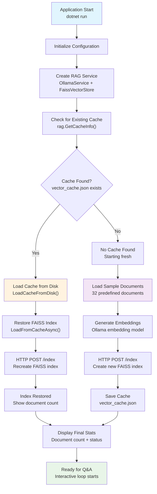

# Simple RAG .NET with Persistent FAISS

A Retrieval-Augmented Generation (RAG) implementation in .NET with persistent FAISS vector storage using Ollama for embeddings and completions.

## Overview

This project demonstrates a production-ready RAG system with persistence that:

1. **Persistent Storage**: Vectors and documents survive service restarts
2. **FAISS Integration**: High-performance similarity search via Python service
3. **Dual Models**: Separate Ollama models for embeddings and completions
4. **Local Caching**: .NET-side caching for faster recovery
5. **Auto-Recovery**: Automatically loads existing data on startup

## Prerequisites

- .NET 8.0 SDK
- Python 3.8+ with FastAPI, FAISS, and NumPy
- Access to an Ollama server (local or remote)

## Configuration

The application is configured to use:
- **Ollama Server**: `http://servers.askmanyai.net:8889/ollama`
- **Embed Model**: `snowflake-arctic-embed2:latest`
- **Completion Model**: `llama3.2:latest`
- **FAISS Service**: `http://localhost:8001`

You can modify these settings in `Program.cs`.

## How It Works

1. **Startup**: System checks for existing cache and FAISS data, loads automatically
2. **FAISS Service**: Python FastAPI service with persistent binary storage (`faiss_index.bin`)
3. **Document Storage**: Text stored in JSON (`documents.json`) and cached locally (`vector_cache.json`)
4. **Embedding**: Documents converted to vectors using Ollama embed model
5. **Indexing**: Vectors stored in FAISS index with auto-save on updates
6. **Query**: Questions embedded and searched against persistent FAISS index
7. **Generation**: Retrieved context used with Ollama completion model for answers

## Startup Flow

Here's exactly what happens when you run `dotnet run`:



### **Startup Phases Explained**

#### **1. Configuration Setup** 
The application initializes with predefined Ollama and FAISS service URLs:
- **Ollama Server**: `http://servers.askmanyai.net:8889/ollama`
- **Embed Model**: `snowflake-arctic-embed2:latest`
- **Completion Model**: `llama3.2:latest`
- **FAISS Service**: `http://localhost:8001`

#### **2. Service Initialization**
Creates the RAG service with OllamaService and FaissVectorStore instances that immediately check for existing cache.

#### **3. Cache Discovery Phase**
The system checks for existing data:
- **Local Cache**: `vector_cache.json` (documents + embeddings)
- **FAISS Files**: `faiss_index.bin` + `documents.json`
- **Document Count**: How many documents are cached

#### **4A. Cache Found Path (Fast Startup)**
If existing cache is found:
1. **Load Local Cache**: Deserializes documents and embeddings from `vector_cache.json`
2. **Recreate FAISS Index**: Sends cached vectors to FAISS service via HTTP POST `/index`
3. **Ready in ~2-5 seconds**: Full knowledge base available instantly

#### **4B. No Cache Path (Fresh Start)**
If no cache exists:
1. **Load Sample Documents**: 32 predefined documents across multiple domains
2. **Generate Embeddings**: Calls Ollama embedding model for each document (~30-60 seconds)
3. **Create FAISS Index**: Sends new vectors to FAISS service
4. **Save Cache**: Persists everything to `vector_cache.json` for future fast startups

#### **5. Ready State**
The system displays final statistics and enters the interactive Q&A loop where users can:
- Ask questions about the knowledge base
- Use commands: `save`, `clear`, `info`, `quit`

### **Startup Performance**

- **Fast Path (Cache Exists)**: ~2-5 seconds, no embedding calls needed
- **Slow Path (Fresh Start)**: ~30-60 seconds, generates 32 embeddings
- **Persistence**: All data survives restarts for consistently fast subsequent startups

## Setup and Running

### 1. Install Python Dependencies

```bash
pip install -r requirements.txt
```

Or manually:
```bash
pip install fastapi gunicorn uvicorn[standard] faiss-cpu numpy requests
```

### 2. Start the FAISS Service

```bash
python start_faiss_service.py
```

The FAISS service will be available at `http://localhost:8001`

### 3. Test FAISS Service (Optional)

```bash
python test_faiss_service.py
```

### 4. Run the .NET Application

```bash
dotnet run
```

### Quick Start (All Services)

**Windows:**
```cmd
start_services.bat
```

**Linux/Mac:**
```bash
./start_services.sh
```

These scripts will automatically start the FAISS service, test it, and then run the .NET application.

## Example Usage

```
=== Simple RAG Implementation ===

Checking for existing data...
No existing cache found, starting fresh
Adding comprehensive knowledge base...
Ready! Knowledge base contains 32 documents.
Ask questions about animals, technology, science, geography, health, or any topic!

Question: What are cats known for?
Answer: Cats are known for their independence and hunting skills. They have excellent night vision and can rotate their ears 180 degrees.

Question: What is artificial intelligence?
Answer: Artificial Intelligence (AI) is the simulation of human intelligence in machines. It includes machine learning, natural language processing, and computer vision.

Question: How tall is Mount Everest?
Answer: Mount Everest is the highest mountain on Earth, standing at 29,032 feet (8,849 meters) above sea level. It's located in the Himalayas.

Question: info
Knowledge base info:
  Documents: 32
  Cache exists: true
  Cache created: 12/19/2024 3:45:22 PM

Question: quit
Goodbye!
```

## Project Structure

### .NET Application
- `Program.cs` - Main application with persistence support and cache recovery
- `Services/OllamaService.cs` - Ollama API client (separate embed/completion models)
- `Services/RagService.cs` - RAG orchestrator with persistence methods
- `Services/FaissVectorStore.cs` - Persistent FAISS vector database client

### Python FAISS Service
- `start_faiss_service.py` - Persistent FastAPI service with auto-save/load
- `test_faiss_service.py` - Test script for service validation
- `requirements.txt` - Python dependencies for easy installation

### Persistent Data Files
- `faiss_index.bin` - FAISS vector index (binary format)
- `documents.json` - Document texts (JSON format)
- `vector_cache.json` - .NET local cache (JSON format)

## API Endpoints (FAISS Service)

- `POST /index` - Create/update vector index (auto-saves to disk)
- `POST /query` - Search similar vectors with document retrieval
- `GET /health` - Health check with persistence status
- `GET /stats` - Index statistics and file sizes
- `POST /save` - Manual save to disk
- `POST /load` - Manual load from disk
- `DELETE /clear` - Clear all data and files
- `GET /` - Service information

## Interactive Commands

While running the .NET application, you can use these commands:

- `save` - Manually save all data to disk
- `clear` - Clear all cached data and FAISS index
- `info` - Show knowledge base statistics
- `quit` - Exit the application

## Data Persistence

### Automatic Persistence
- **FAISS index** automatically saved on every update
- **Document cache** saved locally by .NET application
- **Recovery** happens automatically on startup

### Manual Control
```bash
# Clear all persistent data
curl -X DELETE http://localhost:8001/clear

# Manual save trigger
curl -X POST http://localhost:8001/save

# View persistence status
curl http://localhost:8001/health
```

## Performance Benefits

- **Fast Startup**: Existing data loads in seconds
- **No Re-embedding**: Cached vectors avoid expensive re-computation
- **Incremental Updates**: Add new documents without rebuilding entire index
- **Memory Efficient**: Large datasets can be partially loaded as needed

## Sample Test Questions

Try asking these questions to test the comprehensive knowledge base:

### **Animals & Biology**
- **"How do dolphins communicate?"** ← Excellent test for vector search!
- **"What are cats known for?"**
- **"How long can elephants live?"**
- **"What do bees do for plants?"**
- **"Which birds cannot fly?"**
- **"How many dog breeds exist?"**
- **"What makes elephants special?"**

### **Technology & Science**
- **"What is artificial intelligence?"** ← Great for testing AI knowledge!
- **"What is machine learning?"**
- **"What is Python used for?"**
- **"How does cloud computing work?"**
- **"What are renewable energy sources?"**
- **"What is the Internet?"**
- **"What can smartphones do?"**

### **Space & Physics**
- **"How far is the Sun from Earth?"**
- **"What makes black holes special?"**
- **"What is the speed of light?"**
- **"Why is Mars called the Red Planet?"**
- **"How often does the Moon orbit Earth?"**
- **"What influences ocean tides?"**

### **Geography & History**
- **"Where is Mount Everest?"**
- **"How long is the Great Wall of China?"**
- **"Where is the Amazon Rainforest?"**
- **"Which ocean is the largest?"**
- **"What did Ancient Egyptians build?"**
- **"What is the Amazon called?"**

### **Health & Human Body**
- **"How many neurons are in the human brain?"**
- **"How many times does the heart beat per day?"**
- **"What is Vitamin D good for?"**
- **"What are the benefits of exercise?"**
- **"How much energy does the brain use?"**

### **Food & Culture**
- **"Where did pizza originate?"**
- **"Where does coffee come from?"**
- **"What is rice used for globally?"**
- **"What are the benefits of dark chocolate?"**
- **"What does coffee contain?"**

### **Environment & Climate**
- **"What is climate change?"**
- **"How does photosynthesis work?"**
- **"What materials can be recycled?"**
- **"What is biodiversity?"**
- **"What do plants convert sunlight into?"**

### **Cross-Topic Questions** (Test smart retrieval across multiple domains)
- **"What animals use sound like technology?"** ← Should find dolphins + echolocation
- **"What foods provide health benefits?"** ← Should find chocolate, coffee info
- **"Which technologies help the environment?"** ← Should find renewable energy
- **"What processes convert energy?"** ← Should find photosynthesis + brain metabolism
- **"What things have memory?"** ← Should find elephants + computers

### **Edge Case Questions** (Test system limits)
- **"Tell me about unicorns"** ← Should say no information available
- **"What is 2+2?"** ← Should say no information available
- **"How to cook pasta?"** ← Should say no information available

### **System Commands**
- **`info`** ← Show knowledge base statistics and cache information
- **`save`** ← Manually save all data to disk (FAISS + local cache)
- **`clear`** ← Reset the entire knowledge base and clear all caches
- **`quit`** ← Exit the application gracefully

### **Recommended Testing Sequence**

1. **Start with basic questions:**
   - "How do dolphins communicate?"
   - "What is artificial intelligence?"

2. **Try cross-domain questions:**
   - "What animals use sound like technology?"
   - "What foods provide health benefits?"

3. **Test system boundaries:**
   - "Tell me about unicorns"
   - `info` command

4. **Explore different topics:**
   - Pick questions from each category above

### **Expected Quality Results**
With the optimized system, you should get detailed, accurate responses like:

```
Question: How do dolphins communicate?
Found 3 documents from FAISS:
  - Distance 102.994: Dolphins are highly intelligent marine mammals...
Returning 1 documents above similarity threshold
Answer: Dolphins are highly intelligent marine mammals. They use echolocation to navigate and communicate with each other through complex vocalizations.

Question: What is artificial intelligence?
Answer: Artificial Intelligence (AI) is the simulation of human intelligence in machines. It includes machine learning, natural language processing, and computer vision.
```

## License

MIT 